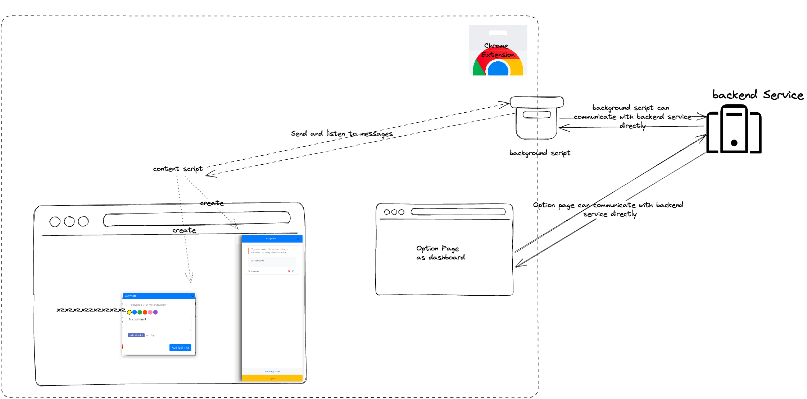
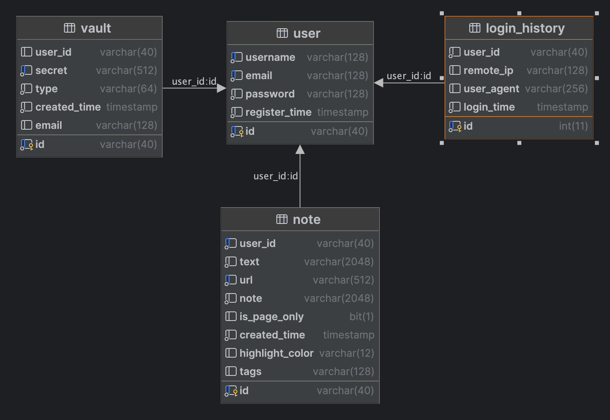

# <!--fit--> SaltyNote Overview

1000ft overview of SaltyNote

https://github.com/SaltyNote

<!-- This is presenter note. You can write down notes through HTML comment. -->

---

---

---

<!-- _backgroundColor: "#123" -->
<!-- _color: "#fff" -->

# Tech Stack
### Backend
Java 17 + Spring Boot v3 + mongodb + redis

(*Graalvm to generate native image*)
### Extension
Vue 2 + Bootstrap 4 + Webpack + Chrome Extension API

---
<!-- _backgroundColor: "#1e2022" -->
<!-- _color: "#fff" -->

# Schema (SQL)
 

---

<!-- _backgroundColor: "#123" -->
<!-- _color: "#fff" -->

# RESTful API
### 👉 Demo with Swagger UI

---

# Story (Backend)
1. Auth framework with *Access Token* and *Refresh Token*
2. Rate limit with Nginx (why not inside the service?)
3. Cache with Redis (How schema change affects cache?)
4. Anti-abuse of massive registration (verification Code)
5. UUID vs Snowflake ID 
   a. What is the problem with UUID?
   b. Snowflake ID ends in 09/07/2023, how to fix it?
6. Why migrated to MongoDB? (For `tags`)

---

<!-- _backgroundColor: "#123" -->
<!-- _color: "#fff" -->

# Story (Extension)
1. How it work? (Inject the UI in the host page)
2. How to avoid css polluting the host page?
3. How to refresh access token with refresh token?
4. How to handle canvas only page, like Google Doc?

---

# Next Step
1. Re-create the website with SPA
2. Build the mobile app with flutter, maybe?
3. Implement some pro features, e.g.
   a. Unlimited note (free: 50 per day)
   b. Create team to share notes
   c. Dark theme support
   d. ...
---

<!-- _backgroundColor: "#123" -->
<!-- _color: "#fff" -->
### Thank you! 👏